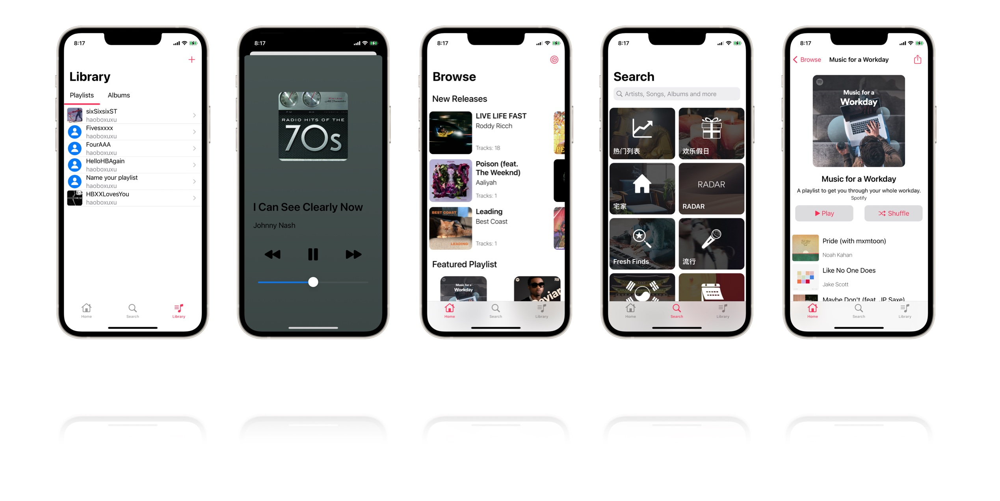

# HBMusic


**A pure Swift Spotify Music App in Apple Music style.**

### How to run

`pod install`

Put your tokens in `tokens.swift` like this

```
let _ClientID = "xxx"
let _ClientSecret = "xxx"
let _RedirectURI = "xxx"
```

### Hint

[Spotify Authorization](https://developer.spotify.com/documentation/general/guides/authorization/)

[Spotify Web API](https://developer.spotify.com/documentation/web-api/reference/#/)

